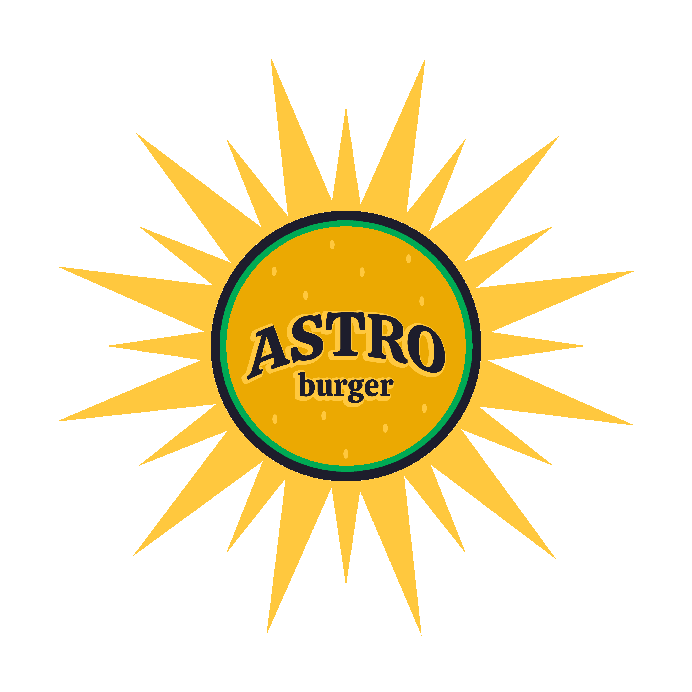
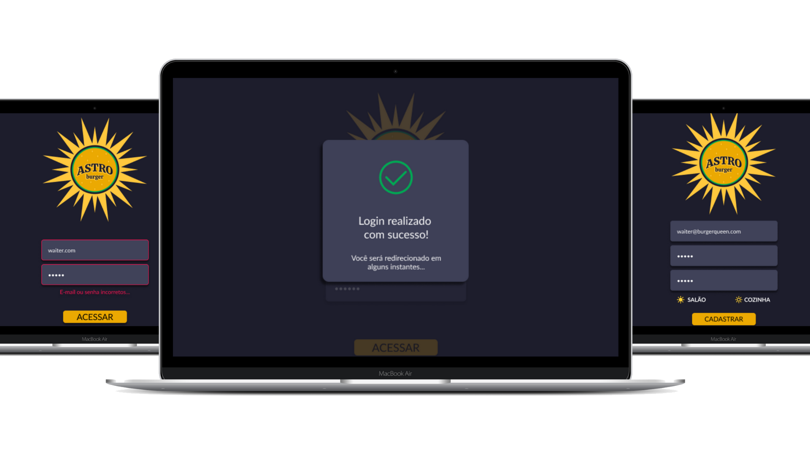
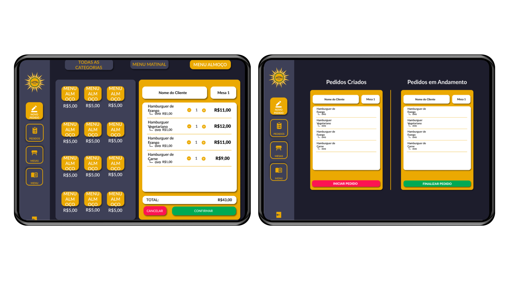

<h1 align="center" id="topo">
  
</h1>

# AstroBurger
## _Projeto realizado durante o bootcamp da [<Laboratória>](https://github.com/Laboratoria)_

O desafio *Burguer Queen* proposto pela Laboratória, é de desenvolver uma interface para auxiliar funcionários do salão (garçons e garçonetes) e da cozinha (chefs) a registrarem e prepararem os pedidos de maneira eficiente.

_*Considerações Gerais:*_
- Manter a interface e o estado sincronizados com React
- Ser um SPA (Single Page App)
- Ser responsivo em *tablets*
- Definir a estrutura de pastas e arquivos
- Usar JavaScript (ES6+) para a lógica do projeto

> Status do Projeto: Concluído :heavy_check_mark:

<h4> Você pode acessar a aplicação <a href="http://astroburger.vercel.app/">clicando aqui</a> e utilizar um dos logins de teste abaixo:</h4>

|             Salão            	|           Cozinha           	|
|:----------------------------:	|:---------------------------:	|
|   salao@astroburger.com.br 	  |     chef@astroburger.com.br   |
|            123456            	|            123456           	|

---

## Índice

- [1. Apresentação do Problema](#1-apresentação-do-problema)
  - [1.1. 1ª História de Usuário](#11-primeira-história-de-usuário)
  - [1.2. 2ª História de Usuário](#12-segunda-história-de-usuário)
  - [1.3. 3ª História de Usuário](#13-terceira-história-de-usuário)
  - [1.4. 4ª História de Usuário](#14-quarta-história-de-usuário)
- [2. Identificação Visual da Marca](#2-identificação-visual-da-marca)
- [3. Planejamento](#3-planejamento)
- [4. Teste de Usabilidade](#4-teste-de-usabilidade)
- [5. Ferramentas Utilizadas](#5-ferramentas-utilizadas)
  - [5.1. Código](#51-código)
  - [5.2. Dados e API](#52-dados-e-api)
  - [5.3. Protótipos e Tratamento de Imagens](#53-protótipos-e-tratamento-de-imagens)
  - [5.4. Planejamento](#54-planejamento)
- [6. Considerações Finais](#6-considerações-finais)
- [7. Desenvolvedoras](#7-desenvolvedoras)

---

## 1. Apresentação do Problema

O cliente é uma hamburgueria chamada AstroBurger e pediu um sistema que funcionasse bem em tablets e que o ajudasse a otimizar o atendimento e preparo os pedidos.

Para melhor estruturar o projeto, o _Product Owner_ nos apresentou quatro histórias de usuário:

### 1.1. Primeira História de Usuário
> Garçom/Garçonete deve poder entrar no sistema, caso já tenha usuário criado, ou criar um novo usuário.*
Eu, como garçom/garçonete quero entrar no sistema de pedidos.

*Critérios de aceitação*
O que deve acontecer para satisfazer as necessidades do usuário?

- Acessar uma tela de login.
- Inserir email e senha.
- Receber mensagens de erros compreensíveis, conforme o erro e as informações inseridas.
- Entrar no sistema de pedidos caso as credenciais forem corretas.
- Definição de pronto

*O acordado abaixo deve acontecer para dizer que a história está terminada:*
Você deve ter recebido code review de pelo menos uma parceira.
Fez testes unitários e, além disso, testou seu produto manualmente.
Você fez testes de usabilidade e incorporou o feedback do usuário.
Você deu deploy de seu aplicativo e marcou sua versão (tag git).

### 1.2. Segunda História de Usuário
> Garçom/Garçonete deve ser capaz de anotar o pedido do cliente
Eu como garçom/garçonete quero poder anotar o pedido de um cliente para não depender da minha memória, saber quanto cobrar e poder enviar os pedidos para a cozinha para serem preparados em ordem.

*Critérios de aceitação*
O que deve acontecer para satisfazer as necessidades do usuário?

- Anotar o nome do cliente.
- Adicionar produtos aos pedidos.
- Excluir produtos.
- Ver resumo e o total da compra.
- Enviar o pedido para a cozinha (guardar em algum banco de dados).
- Funcionar bem em um tablet.

*Definição de pronto*
O acordado abaixo deve acontecer para dizer que a história está terminada:

Você deve ter recebido code review de pelo menos uma parceira.
Fez testes unitários e, além disso, testou seu produto manualmente.
Você fez testes de usabilidade e incorporou o feedback do usuário.
Você deu deploy de seu aplicativo e marcou sua versão (tag git).

### 1.3. Terceira História de Usuário
> Chefe de cozinha deve ver os pedidos
Eu como chefe de cozinha quero ver os pedidos dos clientes em ordem, poder marcar que estão prontos e poder notificar os garçons/garçonetes que o pedido está pronto para ser entregue ao cliente.

*Critérios de aceitação*
- Ver os pedidos ordenados à medida em que são feitos.
- Marcar os pedidos que foram preparados e estão prontos para serem servidos.
- Ver o tempo que levou para preparar o pedido deSAP006-burger-queen-api-clientsde que chegou, até ser marcado como concluído.

*Definição de pronto*
Você deve ter recebido code review de pelo menos uma parceira.
Fez testes unitários e, além disso, testou seu produto manualmente.
Você fez testes de usabilidade e incorporou o feedback do usuário.
Você deu deploy de seu aplicativo e marcou sua versão (tag git).

### 1.4. Quarta História de Usuário
> Garçom/Garçonete deve ver os pedidos prontos para servir
Eu como garçom/garçonete quero ver os pedidos que estão prontos para entregá-los rapidamente aos clientes.

*Critérios de aceitação*
- Ver a lista de pedidos prontos para servir.
- Marcar os pedidos que foram entregues.

*Definição de pronto*
Você deve ter recebido code review de pelo menos uma parceira.
Fez testes unitários e, além disso, testou seu produto manualmente.
Você fez testes de usabilidade e incorporou o feedback do usuário.
Você deu deploy de seu aplicativo e marcou sua versão (tag git).
Os dados devem ser mantidos intactos, mesmo depois que um pedido for finalizado. Tudo isso para poder ter estatísticas no futuro.

  <a href="#topo">
  ⬆ Voltar ao topo
 </a>

---

# 2. Identificação Visual da Marca

A paleta de cores foi escolhida pra que a aplicação seja confortável para visualização prolongada, remetendo ao sol, nosso astro principal e trazendo cores que lembram os essenciais de toda hamburgeria: ketchup, mostarda e gergelim.

De acordo com a primeira história de usuário, desenhamos um protótipo de alta fidelidade das telas de login e cadastro.

Seguindo as histórias de usuário, pudemos prototipar também as telas de novo pedido e cozinha.

  <a href="#topo">
  ⬆ Voltar ao topo
 </a>

---

# 3. Planejamento

Desde o primeiro contato com a proposta, o planejamento foi ponto principal. Optamos por utilizar a ferramenta [Projects](https://github.com/caxconte/SAP006-burger-queen-api-client/projects/1) do github pra estruturar nosso board de planejamento, com o template de Kanban automatizado.

  <a href="#topo">
  ⬆ Voltar ao topo
 </a>

---

# 4. Teste de Usabilidade

Após o término da primeira história, fizemos o primeiro teste de usabilidade. Eles foram realizados de forma rápida, prática e informal através do link do deploy no Vercel. Foram sugeridas algumas mudanças, das quais priorizamos:

- Aumento do tamanhos dos botões;
- Deixar os botões ativos;
- Erro de rota privada ao tentar fazer cadastro;

  <a href="#topo">
  ⬆ Voltar ao topo
 </a>

---

# 5. Ferramentas Utilizadas

### 5.1 Código

### 5.2 Dados e API

### 5.3 Protótipos e Tratamento de Imagens

### 5.4 Planejamento

 Projects

  <a href="#topo">
  ⬆ Voltar ao topo
 </a>

---

# 6. Considerações Finais

Você também pode testar e manipular nosso projeto localmente, basta seguir os seguintes passos:

> 1 - Clone o repositório da nossa página GitHub

(SSH):
js ('*.js')  

`$ git clone git@github.com:caxconte/SAP006-burger-queen-api-client.git`

> 2 - Assegure-se de ter instalado o [Node.JS](https://nodejs.org/en/)

> 3 - Instale e inicie o [NPM](https://www.npmjs.com/get-npm)

`$ npm install`

`$ npm start`

---

# 7. Desenvolvedoras

Agradecemos às seguintes pessoas que contribuíram para este projeto:

  <table>
    <thead>
      <tr>
        <th align="center">Camila Conte</th>
        <th align="center">Taiene Yamazaki</th>
      </tr>
    </thead>
    <tbody>
      <tr>
        <td align="center">
          <a href="#">
             
          </a>
        </td>
        <td align="center">
          <a href="#">
             
          </a>
        </td>
      </tr>
      <tr>
        <td align="center">
          
          
        </td>
        <td align="center">
          
          
        </td>
      </tr>
    </tbody>
  </table>

  <a href="#topo">
  ⬆ Voltar ao topo
 </a>

